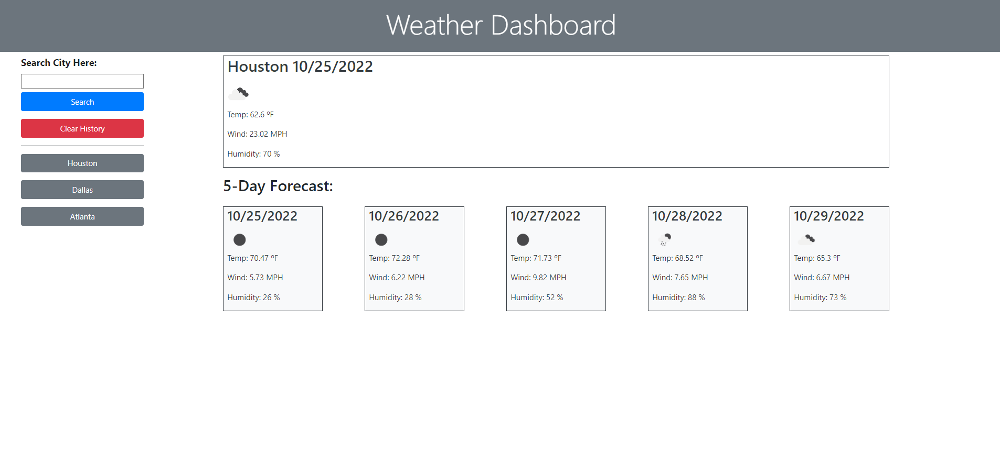

# Create a Weather Dashboard

## Project Task
Build a weather dashboard that will run in the browser and feature dynamically updated HTML and CSS.


## How does this application work?
When the user first open the application, he/she will be brought to the *Start Page*.


### *Start Page:*
At this page, the user type in the city's name in the search bar:
1. If the city name is in the database -> The current weather and 5-days weather 
   forecast will be presented on the same page.
2. if the city name is not in the database -> *404 Page*


### *404 Page:*
At this page:
1. Promote the user to check the spelling and try again.


### *Additional Feature*
The user can use *Clear History* button to clear the search history.


## User Story

```
A traveler wants to see the weather outlook for multiple cities so he can plan the trip accordingly.
```

## Acceptance Criteria

```
This application should include:
1. When user search for a city, the current and future conditions for that city and 
   that city is added to the search history.
2. The city name, the date, an icon representation of weather conditions, the temperature, 
   the humidity, and the the wind speed are presented for current weather. 
3. A 5-day forecast that displays the date, an icon representation of weather conditions, 
   the temperature, the wind speed, and the humidity are presented for future weather.
4. When user click on a city in the search history, the current and future conditions for
   that city is again presented.
```

## Moke Up

The following image shows the web application's appearance:

*Start Page:*


*Start Page with Results:*


*404 Page:*


## URL
